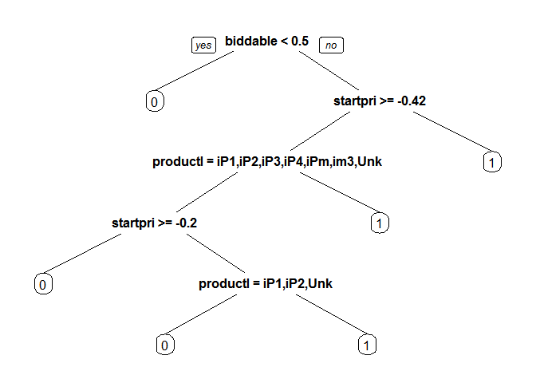
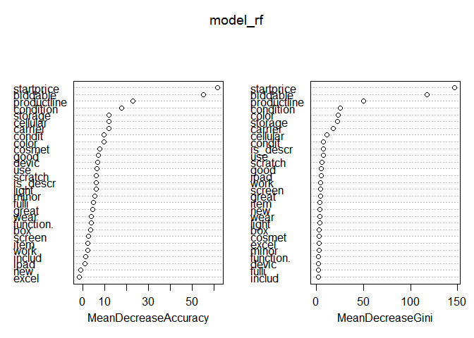

# Kaggle Competition, The Analytics Edge
Morozov Gleb  
2 августа 2015 г.  

В данной статье я опишу опыт своего первого участия в соревнованиии по Machine Learning, проводимых на сайте Kaggle.com. Описываемое соревнование проводилось в рамках курса "The Analytics Edge" от "Massachusetts Institute of Technology".

## Описание задачи

Любой продавец хотел бы знать какие характеристики товара повышают вероятность продажи товара. В данном соревновании предлагалось исследовать модели, которые предсказывали бы вероятность продажи Apple iPad на базе данных, полученных с сайта eBay. 

## Данные

Данные предлагаемые для изучения состояли из двух файлов:

- `eBayiPadTrain.csv` - набор данных для создания модели. Содержит 1861 товар.
- `eBayiPadTest.csv` - данные для оценки модели

Для начала подключим библиотеки, применяемые в работе.

```r
library(dplyr) # Для удобной работы с данными
library(readr) # Для загрузки данных в удобном формате
```

Теперь загрузим данные.

```r
eBayTrain <-  read_csv("eBayiPadTrain.csv")
eBayTest <-  read_csv("eBayiPadTest.csv")
```

Посмотрим на структуру данных.

```r
summary(eBayTrain)
```

```
##  description           biddable        startprice      condition        
##  Length:1861        Min.   :0.0000   Min.   :  0.01   Length:1861       
##  Class :character   1st Qu.:0.0000   1st Qu.: 80.00   Class :character  
##  Mode  :character   Median :0.0000   Median :179.99   Mode  :character  
##                     Mean   :0.4498   Mean   :211.18                     
##                     3rd Qu.:1.0000   3rd Qu.:300.00                     
##                     Max.   :1.0000   Max.   :999.00                     
##    cellular           carrier             color          
##  Length:1861        Length:1861        Length:1861       
##  Class :character   Class :character   Class :character  
##  Mode  :character   Mode  :character   Mode  :character  
##                                                          
##                                                          
##                                                          
##    storage          productline             sold           UniqueID    
##  Length:1861        Length:1861        Min.   :0.0000   Min.   :10001  
##  Class :character   Class :character   1st Qu.:0.0000   1st Qu.:10466  
##  Mode  :character   Mode  :character   Median :0.0000   Median :10931  
##                                        Mean   :0.4621   Mean   :10931  
##                                        3rd Qu.:1.0000   3rd Qu.:11396  
##                                        Max.   :1.0000   Max.   :11861
```

```r
str(eBayTrain)
```

```
## Classes 'tbl_df', 'tbl' and 'data.frame':	1861 obs. of  11 variables:
##  $ description: chr  "iPad is in 8.5+ out of 10 cosmetic condition!" "Previously used, please read description. May show signs of use such as scratches to the screen and " "" "" ...
##  $ biddable   : int  0 1 0 0 0 1 1 0 1 1 ...
##  $ startprice : num  159.99 0.99 199.99 235 199.99 ...
##  $ condition  : chr  "Used" "Used" "Used" "New other (see details)" ...
##  $ cellular   : chr  "0" "1" "0" "0" ...
##  $ carrier    : chr  "None" "Verizon" "None" "None" ...
##  $ color      : chr  "Black" "Unknown" "White" "Unknown" ...
##  $ storage    : chr  "16" "16" "16" "16" ...
##  $ productline: chr  "iPad 2" "iPad 2" "iPad 4" "iPad mini 2" ...
##  $ sold       : int  0 1 1 0 0 1 1 0 1 1 ...
##  $ UniqueID   : int  10001 10002 10003 10004 10005 10006 10007 10008 10009 10010 ...
```

Набор данных состоит из 11 переменных:

- `description` - текстовое описание товара, предоставляемое продавцом 
- `biddable` - товар выставлен на аукционе ( = 1) или с фиксированной ценой ( = 0)  
- `startprice` - стартовая цена для аукциона (если biddable=1) или цена продажи (если biddable=0)
- `condition` - состояние товара (новый, б/у и т.д.)
- `cellular` - товар с мобильной связью ( = 1) или нет ( = 0)   
- `carrier` - оператор связи (если cellular = 1) 
- `color` - цвет      
- `storage` - размер памяти   
- `productline` - название модели товара
- `sold` - был ли товар продан ( = 1) или нет ( =0). *Это будет зависимая переменная.*     
- `UniqueID` - уникальные порядковый номер

Таким образом у нас есть три типа переменных: текстовая `description`, численная `startprice` и все остальные - факторные.

## Создание дополнительных переменных

Посмотрим у какой части из товаров есть описание

```r
table(eBayTrain$description == "")
```

```
## 
## FALSE  TRUE 
##   790  1071
```

Так как далеко не все товары имеют описание, то я предположил, что этот параметр может влиять на вероятность продажи. Чтобы это учесть создадим переменную, которая будет принимать значение 1, если описание есть, и 0, в обратном случае.

```r
eBayTrain$is_descr = as.factor(eBayTrain$description == "")
table(eBayTrain$description == "", eBayTrain$is_descr)
```

```
##        
##         FALSE TRUE
##   FALSE   790    0
##   TRUE      0 1071
```

## Создание переменных для модели из текстового описания

На базе текстового описания создадим переменные для модели путём выделения часто встречающихся слов. Для этого используем библиотеку `tm`.


```r
library(tm) ## Загружаем библиотеку
```

```
## Loading required package: NLP
```

```r
 ## Создаём корпус из текста, необходимый для работы библиотеки
 CorpusDescription <-  Corpus(VectorSource(c(eBayTrain$description, eBayTest$description)))
 ## Приводим текст к строчным буквам
 CorpusDescription <-  tm_map(CorpusDescription, content_transformer(tolower))
 CorpusDescription <-  tm_map(CorpusDescription, PlainTextDocument)
 ## Удаляем знаки препинания
 CorpusDescription <-  tm_map(CorpusDescription, removePunctuation)
 ## Удаляем так называемые стоп-слова, т.е. слова, не несущие смысловой нагрузки
 CorpusDescription <-  tm_map(CorpusDescription, removeWords, stopwords("english"))
 ## Производим стемминг, т.е. приводим слова к смысловым основам
 CorpusDescription <-  tm_map(CorpusDescription, stemDocument)
 ## Создаём частотную матрицу
 dtm <-  DocumentTermMatrix(CorpusDescription)
 ## Удаляем редкочастотные слова
 sparse <-  removeSparseTerms(dtm, 0.97)

 ## Преобразуем частотную матрицу в data.frame и разделим тестовую и тренировочную выборку 
DescriptionWords = as.data.frame(as.matrix(sparse))
colnames(DescriptionWords) = make.names(colnames(DescriptionWords))
DescriptionWordsTrain = head(DescriptionWords, nrow(eBayTrain))
DescriptionWordsTest = tail(DescriptionWords, nrow(eBayTest))
```

Теперь приведём оставшиеся текстовые переменные к типу данных `factor`, чтобы предотвратить их обработку моделью как текст. И объединим их с переменными, полученными из описания товара. Для этого используем очень удобную библиотеку `magnittr`

```r
library(magrittr)
eBayTrain %<>% mutate(condition = as.factor(condition), cellular = as.factor(cellular),
        carrier = as.factor(carrier), color = as.factor(color),
        storage = as.factor(storage), productline = as.factor(productline), sold = as.factor(sold)) %>% 
        select(-description, -UniqueID ) %>% cbind(., DescriptionWordsTrain)
```

Посмотрим на полученный набор переменных.

```r
str(eBayTrain)
```

```
## 'data.frame':	1861 obs. of  30 variables:
##  $ biddable   : int  0 1 0 0 0 1 1 0 1 1 ...
##  $ startprice : num  159.99 0.99 199.99 235 199.99 ...
##  $ condition  : Factor w/ 6 levels "For parts or not working",..: 6 6 6 4 5 6 3 3 6 6 ...
##  $ cellular   : Factor w/ 3 levels "0","1","Unknown": 1 2 1 1 3 2 1 1 2 1 ...
##  $ carrier    : Factor w/ 7 levels "AT&T","None",..: 2 7 2 2 6 1 2 2 6 2 ...
##  $ color      : Factor w/ 5 levels "Black","Gold",..: 1 4 5 4 4 3 3 5 5 5 ...
##  $ storage    : Factor w/ 5 levels "128","16","32",..: 2 2 2 2 5 3 2 2 4 3 ...
##  $ productline: Factor w/ 12 levels "iPad 1","iPad 2",..: 2 2 4 9 12 9 8 10 1 4 ...
##  $ sold       : Factor w/ 2 levels "0","1": 1 2 2 1 1 2 2 1 2 2 ...
##  $ is_descr   : Factor w/ 2 levels "FALSE","TRUE": 1 1 2 2 1 2 2 2 2 2 ...
##  $ box        : num  0 0 0 0 0 0 0 0 0 0 ...
##  $ condit     : num  1 0 0 0 0 0 0 0 0 0 ...
##  $ cosmet     : num  1 0 0 0 0 0 0 0 0 0 ...
##  $ devic      : num  0 0 0 0 0 0 0 0 0 0 ...
##  $ excel      : num  0 0 0 0 0 0 0 0 0 0 ...
##  $ fulli      : num  0 0 0 0 0 0 0 0 0 0 ...
##  $ function.  : num  0 0 0 0 0 0 0 0 0 0 ...
##  $ good       : num  0 0 0 0 0 0 0 0 0 0 ...
##  $ great      : num  0 0 0 0 0 0 0 0 0 0 ...
##  $ includ     : num  0 0 0 0 0 0 0 0 0 0 ...
##  $ ipad       : num  1 0 0 0 0 0 0 0 0 0 ...
##  $ item       : num  0 0 0 0 0 0 0 0 0 0 ...
##  $ light      : num  0 0 0 0 0 0 0 0 0 0 ...
##  $ minor      : num  0 0 0 0 0 0 0 0 0 0 ...
##  $ new        : num  0 0 0 0 0 0 0 0 0 0 ...
##  $ scratch    : num  0 1 0 0 0 0 0 0 0 0 ...
##  $ screen     : num  0 1 0 0 0 0 0 0 0 0 ...
##  $ use        : num  0 2 0 0 0 0 0 0 0 0 ...
##  $ wear       : num  0 0 0 0 0 0 0 0 0 0 ...
##  $ work       : num  0 0 0 0 0 0 0 0 0 0 ...
```

Произведём нормализацию переменной `startprice`, для того, чтобы данная переменная не оказывала чрезмерного влияния на результаты моделей, в связи с её гораздо более широким, по сравнению с другими переменными, диапазоном значении.

```r
eBayTrain$startprice <- (eBayTrain$startprice - mean(eBayTrain$startprice))/sd(eBayTrain$startprice)
```

## Модели

С полученным набором данных будем создавать модели. Для оценки точности оценки моделей будем применять ту же оценку, которая была выбрана в соревновании. Это `AUC`. Данный параметр часто применяется для оценки моделей классификации. Он отражает вероятность с которой модель правилно определит зависимую переменную из случайного набора данных. Идеальная модель покажет значение `AUC` равное 1.0, а модель с равновероятным случайным угадыванием - 0.5.

Так как формат соревнования предполагает ограниченное количество раз в сутки, которое можно будет проверять полученную модель путем загрузки полученных результатов на сайт, то для оценки моделей выделим из тренировчного набора данных собственную тестовую выборку. Для получения сбалансировонной выборки используем библиотеку `caTools`.

```r
set.seed(1000) ## Для воспроизводимости исследования
library(caTools)
split <- sample.split(eBayTrain$sold, SplitRatio = 0.7)
train  <- filter(eBayTrain, split == T)
test <- filter(eBayTrain, split == F)
```


### Логистическая классификация

Создадим модель логистической регрессии

```r
model_glm1 <- glm(sold ~ ., data = train, family = binomial)
```

Посмотрим на значимость переменных для модели

```r
summary(model_glm1)
```

```
## 
## Call:
## glm(formula = sold ~ ., family = binomial, data = train)
## 
## Deviance Residuals: 
##     Min       1Q   Median       3Q      Max  
## -2.6620  -0.7308  -0.2450   0.6229   3.5600  
## 
## Coefficients:
##                                     Estimate Std. Error z value Pr(>|z|)
## (Intercept)                         11.91318  619.41930   0.019 0.984655
## biddable                             1.52257    0.16942   8.987  < 2e-16
## startprice                          -1.96460    0.19122 -10.274  < 2e-16
## conditionManufacturer refurbished    0.92765    0.59405   1.562 0.118394
## conditionNew                         0.64792    0.38449   1.685 0.091964
## conditionNew other (see details)     0.98380    0.50308   1.956 0.050517
## conditionSeller refurbished         -0.03144    0.40675  -0.077 0.938388
## conditionUsed                        0.43817    0.27167   1.613 0.106767
## cellular1                          -13.13755  619.41893  -0.021 0.983079
## cellularUnknown                    -13.50679  619.41886  -0.022 0.982603
## carrierNone                        -13.25989  619.41897  -0.021 0.982921
## carrierOther                        12.51777  622.28887   0.020 0.983951
## carrierSprint                        0.88998    0.69925   1.273 0.203098
## carrierT-Mobile                      0.02578    0.89321   0.029 0.976973
## carrierUnknown                      -0.43898    0.41684  -1.053 0.292296
## carrierVerizon                       0.15653    0.36337   0.431 0.666625
## colorGold                            0.10763    0.53565   0.201 0.840755
## colorSpace Gray                     -0.13043    0.30662  -0.425 0.670564
## colorUnknown                        -0.14471    0.20833  -0.695 0.487307
## colorWhite                          -0.03924    0.22997  -0.171 0.864523
## storage16                           -1.09720    0.50539  -2.171 0.029933
## storage32                           -1.14454    0.51860  -2.207 0.027315
## storage64                           -0.50647    0.50351  -1.006 0.314474
## storageUnknown                      -0.29305    0.63389  -0.462 0.643867
## productlineiPad 2                    0.33364    0.28457   1.172 0.241026
## productlineiPad 3                    0.71895    0.34595   2.078 0.037694
## productlineiPad 4                    0.81952    0.36513   2.244 0.024801
## productlineiPad 5                    2.89336 1080.03688   0.003 0.997863
## productlineiPad Air                  2.15206    0.40290   5.341 9.22e-08
## productlineiPad Air 2                3.05284    0.50834   6.005 1.91e-09
## productlineiPad mini                 0.40681    0.30583   1.330 0.183456
## productlineiPad mini 2               1.59080    0.41737   3.811 0.000138
## productlineiPad mini 3               2.19095    0.53456   4.099 4.16e-05
## productlineiPad mini Retina          3.22474    1.12022   2.879 0.003993
## productlineUnknown                   0.38217    0.39224   0.974 0.329891
## is_descrTRUE                         0.17209    0.25616   0.672 0.501722
## box                                 -0.78668    0.48127  -1.635 0.102134
## condit                              -0.48478    0.29141  -1.664 0.096198
## cosmet                               0.14377    0.44095   0.326 0.744385
## devic                               -0.24391    0.41011  -0.595 0.552027
## excel                                0.83784    0.47101   1.779 0.075268
## fulli                               -0.58407    0.66039  -0.884 0.376464
## function.                           -0.30290    0.59145  -0.512 0.608555
## good                                 0.78695    0.33903   2.321 0.020275
## great                                0.46251    0.38946   1.188 0.235003
## includ                               0.41626    0.42947   0.969 0.332421
## ipad                                -0.31983    0.24420  -1.310 0.190295
## item                                -0.08037    0.35025  -0.229 0.818501
## light                                0.32901    0.40187   0.819 0.412963
## minor                               -0.27938    0.37600  -0.743 0.457462
## new                                  0.08576    0.38444   0.223 0.823479
## scratch                              0.02037    0.26487   0.077 0.938712
## screen                               0.14372    0.28159   0.510 0.609773
## use                                  0.14769    0.21807   0.677 0.498243
## wear                                -0.05187    0.40931  -0.127 0.899154
## work                                -0.25657    0.29441  -0.871 0.383509
##                                      
## (Intercept)                          
## biddable                          ***
## startprice                        ***
## conditionManufacturer refurbished    
## conditionNew                      .  
## conditionNew other (see details)  .  
## conditionSeller refurbished          
## conditionUsed                        
## cellular1                            
## cellularUnknown                      
## carrierNone                          
## carrierOther                         
## carrierSprint                        
## carrierT-Mobile                      
## carrierUnknown                       
## carrierVerizon                       
## colorGold                            
## colorSpace Gray                      
## colorUnknown                         
## colorWhite                           
## storage16                         *  
## storage32                         *  
## storage64                            
## storageUnknown                       
## productlineiPad 2                    
## productlineiPad 3                 *  
## productlineiPad 4                 *  
## productlineiPad 5                    
## productlineiPad Air               ***
## productlineiPad Air 2             ***
## productlineiPad mini                 
## productlineiPad mini 2            ***
## productlineiPad mini 3            ***
## productlineiPad mini Retina       ** 
## productlineUnknown                   
## is_descrTRUE                         
## box                                  
## condit                            .  
## cosmet                               
## devic                                
## excel                             .  
## fulli                                
## function.                            
## good                              *  
## great                                
## includ                               
## ipad                                 
## item                                 
## light                                
## minor                                
## new                                  
## scratch                              
## screen                               
## use                                  
## wear                                 
## work                                 
## ---
## Signif. codes:  0 '***' 0.001 '**' 0.01 '*' 0.05 '.' 0.1 ' ' 1
## 
## (Dispersion parameter for binomial family taken to be 1)
## 
##     Null deviance: 1798.8  on 1302  degrees of freedom
## Residual deviance: 1168.8  on 1247  degrees of freedom
## AIC: 1280.8
## 
## Number of Fisher Scoring iterations: 13
```
Видно, что для простой логистической модели значимых переменных в данных немного

Оценим `AUC` на тестовых данных. Для этого используем библиотеку `ROCR`

```r
library(ROCR)
```

```
## Loading required package: gplots
## 
## Attaching package: 'gplots'
## 
## The following object is masked from 'package:stats':
## 
##     lowess
```

```r
predict_glm <- predict(model_glm1, newdata = test, type = "response" )
ROCRpred = prediction(predict_glm, test$sold)
as.numeric(performance(ROCRpred, "auc")@y.values)
```

```
## [1] 0.8592183
```
Результат, полученный с помощью данной модели уже очень неплох, но необходимо сравнить его оценками других моделей.


### Деревья классификации (CART model)

Теперь посмотрим на результаты полученные с помощью CART модели

```r
library(rpart)
library(rpart.plot)
model_cart1 <- rpart(sold ~ ., data = train, method = "class")
prp(model_cart1)
```

 

```r
predict_cart <- predict(model_cart1, newdata = test, type = "prob")[,2]
ROCRpred = prediction(predict_cart, test$sold)
as.numeric(performance(ROCRpred, "auc")@y.values)
```

```
## [1] 0.8222028
```

Модель производит оценку хуже чем предыдущая. Попробуем улучшить результаты с помощью подбора параметров путём cross-validation. Будем подбирать параметр `cp`, который определяет сложность модели

```r
library(caret)
```

```
## Loading required package: lattice
## Loading required package: ggplot2
## 
## Attaching package: 'ggplot2'
## 
## The following object is masked from 'package:NLP':
## 
##     annotate
```

```r
library(e1071)
tr.control = trainControl(method = "cv", number = 10)
cpGrid = expand.grid( .cp = seq(0.0001,0.01,0.002))
train(sold ~ ., data = train, method = "rpart", trControl = tr.control, tuneGrid = cpGrid )
```

```
## CART 
## 
## 1303 samples
##   29 predictor
##    2 classes: '0', '1' 
## 
## No pre-processing
## Resampling: Cross-Validated (10 fold) 
## 
## Summary of sample sizes: 1173, 1172, 1172, 1173, 1173, 1173, ... 
## 
## Resampling results across tuning parameters:
## 
##   cp      Accuracy   Kappa      Accuracy SD  Kappa SD  
##   0.0001  0.7674163  0.5293876  0.02132149   0.04497423
##   0.0021  0.7896359  0.5714294  0.03938328   0.08143665
##   0.0041  0.7919612  0.5748735  0.03867687   0.07958997
##   0.0061  0.7888843  0.5678360  0.03868024   0.08040614
##   0.0081  0.7888902  0.5678010  0.03657083   0.07592070
## 
## Accuracy was used to select the optimal model using  the largest value.
## The final value used for the model was cp = 0.0041.
```

Вставим предложенное значение и оценим полученную модель

```r
bestcp <- train(sold ~ ., data = train, method = "rpart", trControl = tr.control, tuneGrid = cpGrid )$bestTune
model_cart2 <- rpart(sold ~ ., data = train, method = "class", cp = bestcp)
predict_cart <- predict(model_cart2, newdata = test, type = "prob")[,2]
ROCRpred = prediction(predict_cart, test$sold)
as.numeric(performance(ROCRpred, "auc")@y.values)
```

```
## [1] 0.8024935
```

### Random Forest

Посмотрим на результаты наиболее сложной в теории модели, но очень простой в применении - Random Forest

```r
library(randomForest)
```

```
## randomForest 4.6-10
## Type rfNews() to see new features/changes/bug fixes.
## 
## Attaching package: 'randomForest'
## 
## The following object is masked from 'package:dplyr':
## 
##     combine
```

```r
set.seed(1000)
model_rf <- randomForest(sold ~ ., data = train, importance = T)
predict_rf  <- predict(model_rf, newdata = test, type = "prob")[,2]
ROCRpred = prediction(predict_rf, test$sold)
as.numeric(performance(ROCRpred, "auc")@y.values)
```

```
## [1] 0.8576486
```

Как видим, модель уже показывает наилучшие результаты из всех использованных. Попробуем улучшить её путём отсеивания лишних переменных. В этом нам поможет наличие встроенной в модель оценки важности переменных.

```r
varImpPlot(model_rf)
```

 

По левому графику мы видим, что у модели есть переменная, которые имеют отрицательное значение важности. Уберём её и произведём оценку улучшенной модели.

```r
set.seed(1000)
model_rf2 <- randomForest(sold ~ .-excel, data = train, importance = T)
predict_rf  <- predict(model_rf2, newdata = test, type = "prob")[,2]
ROCRpred = prediction(predict_rf, test$sold)
as.numeric(performance(ROCRpred, "auc")@y.values)
```

```
## [1] 0.8566796
```

Оценка показала, что улучшения модели не произошло, но, исходя из здравого смысла, я считаю, что наличие слова `excel` в описании товара, практически невероятно, что может влиять на продажи, а упрощение модели (без существенного ущерба качеству) улучшает её интерпретацию.

Таким образом, наилучшие результаты из всех исследованных моделей показала логистическая регрессия. На момент написания данного отчёта данная модель занимала 180 место из 1900 участников.


